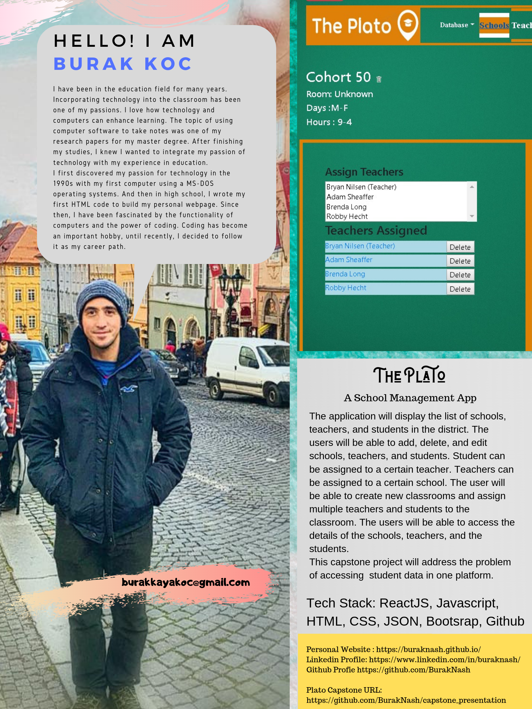
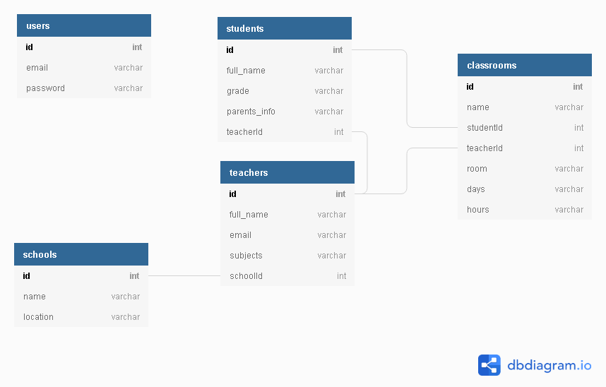

<h1>WELCOME TO PLATO</h1>

<h2>The Plato</h2>
<h4>District Student Database</h4>

<h6>OVERVIEW</h6>

The webpage will display the list of schools, teachers, and students in the district. The administrators will be able to add, delete, and edit schools, teachers, and students. Student can be assigned to a certain teacher. Teachers can be assigned to a certain school. The user will be able to create new classrooms visible to the other users. The users will be able to access the details of the schools, teachers, and the students. 
This capstone project will address the problem of accessing  student data in one platform. 

Tech Stack: ReactJS, Javascript, Html, CSS, JSON, Bootsrap, 

<h6>How to Run the App</h6>
<ul>
<li>git clone https://github.com/BurakNash/capstone_presentation.git</li>
<li>npm install</li>
<li>Go to api folder and click "start"</li>
<li>Go to main directory and click "start the project"</li>
</ul>

